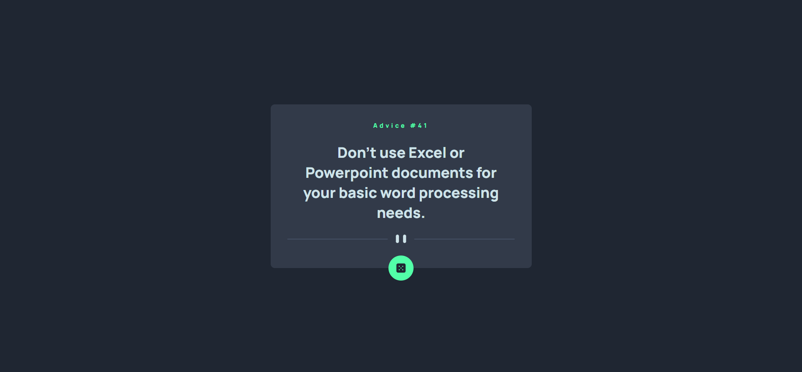

# Frontend Mentor - Advice generator app solution

This is a solution to the [Advice generator app challenge on Frontend Mentor](https://www.frontendmentor.io/challenges/advice-generator-app-QdUG-13db). Frontend Mentor challenges help you improve your coding skills by building real projects.

## Overview

### Screenshot

### Links

- Solution URL: [Click here](https://github.com/aniloli42/frontend-mentor-challenges/tree/main/advice-generator-app)
- Live Site URL: [Click Here](https://aniloli42.github.io/frontend-mentor-challenges/advice-generator-app)

## My process

### Built with

- Semantic HTML5 markup
- CSS custom properties
- Flexbox
- CSS Grid

## Author

- Website - [Anil Oli](https://www.aniloli42.com)
- Frontend Mentor - [@aniloli42](https://www.frontendmentor.io/profile/aniloli42)
