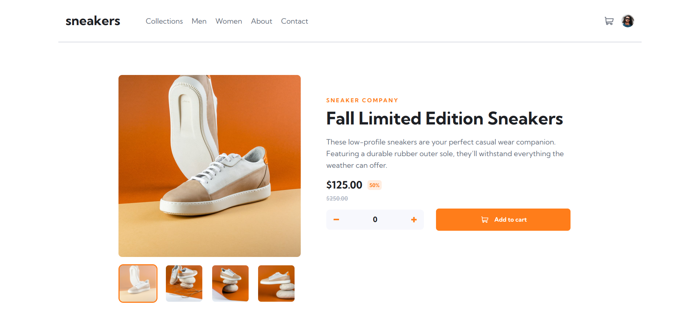

# Frontend Mentor - E-commerce product page solution

This is a solution to the [E-commerce product page challenge on Frontend Mentor](https://www.frontendmentor.io/challenges/ecommerce-product-page-UPsZ9MJp6). Frontend Mentor challenges help you improve your coding skills by building realistic projects.

## Overview

### The challenge

Users should be able to:

- View the optimal layout for the site depending on their device's screen size
- See hover states for all interactive elements on the page
- Open a lightbox gallery by clicking on the large product image
- Switch the large product image by clicking on the small thumbnail images
- Add items to the cart
- View the cart and remove items from it

### Links

- Solution URL: [Click Here](https://github.com/aniloli42/frontend-mentor-challenges/tree/main/ecommerce-product-page)
- Live Site URL: [Click Here](https://ecommerce-product-page-challenge.netlify.app/)

## My process

### Built with

- HTML5
- CSS3
- Javascript

## Author

- Website - [Anil Oli](https://www.aniloli42.com)
- Frontend Mentor - [@aniloli42](https://www.frontendmentor.io/profile/aniloli42)
- Linkedin - [@aniloli](https://www.linkedin.com/in/aniloli)
